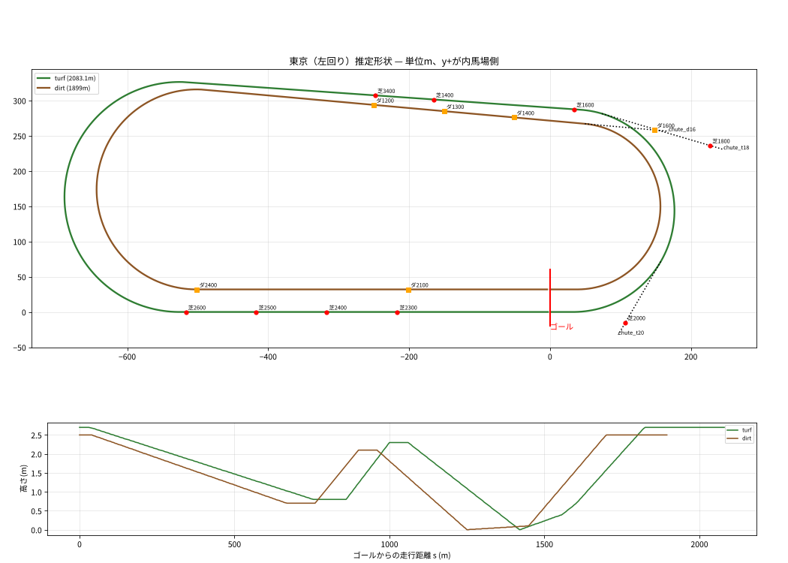
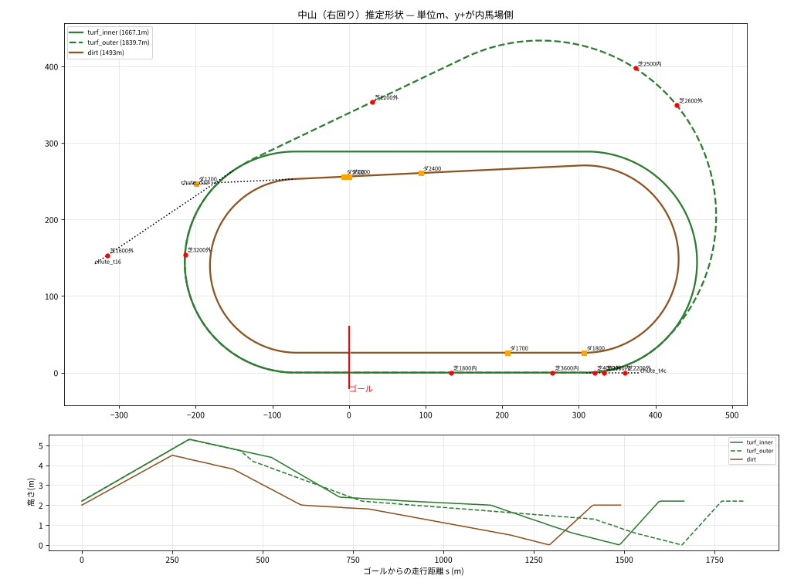
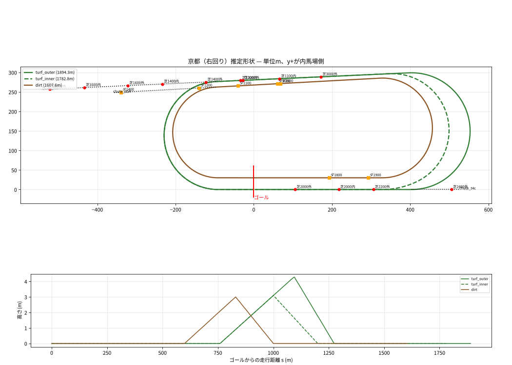
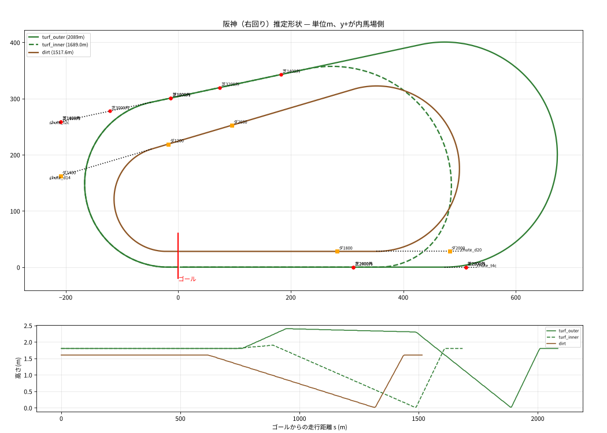

# JRA主要4場 コース再現仕様書（Claude Code向け）

競馬ゲームで 東京・中山・京都・阪神 の芝／ダートコースを再現するための仕様。
同梱の `courses_geometry.json` が**初期形状データ**、本書が**ルールと根拠**。

---

## 0. Claude Codeへの指示（最初に読む）

1. **形状は推定モデル**。1周距離・直線距離などJRA公式の数値は満たしているが、コーナー半径・分岐位置・引き込み線の向きは推定。**JRA公式のコース平面図と照合して調整する工程を必ず入れる**（§6）。
2. **距離の整合性を最優先**。形を調整しても以下は崩さないこと（自動テストにする）:
   - 各周回の1周距離・直線距離（§2の公式値）
   - 各距離のスタート地点 → ゴールまでの走行距離 = レース距離
3. 確度の扱い:
   - 【公式】JRA公式値。変更禁止
   - 【二次】競馬解説サイト等の値。±50m程度の誤差はありうる
   - 【推定】本モデルの推定値。画像照合で自由に修正してよい
4. 不明な点は推測で埋めず、TODOコメントを残してユーザーに確認すること。

---

## 1. データモデル

```
Venue
 ├─ loops      : 閉じた周回、または分岐アーム。segments（直線/円弧）の列
 ├─ layouts    : レースで使う周回（例: 京都 芝外回り / 芝内回り）= loop区間の連結
 ├─ chutes     : 引き込み線・ポケット（本線に接線で合流する直線）
 ├─ starts     : 距離ごとの発走地点
 └─ elevation  : layoutごとの標高プロファイル [s, z]
```

**座標系**
- ゴール板（計測ライン上）が原点。ホームストレッチはx軸上で、y+が内馬場側、スタンドはy<0側。
- 左回り（東京）はゴール地点で+x方向へ、右回り（中山・京都・阪神）は−x方向へ走る。
- `s` はゴールから**走行方向**へ測った距離。`b = 周長 − s` がゴールまでの残り距離。

**Segment**
- `{type:"straight", length}`
- `{type:"arc", length, turn_deg, radius}`：turn_degは+が左旋回、−が右旋回。

**曲線の生成**：`start_pose` から segments を順に積分する（タートル方式）。

```ts
// 円弧: k = rad(turn_deg)/length を曲率として dl ずつ進める
x += r*(sin(h+k*dl) - sin(h));  y += -r*(cos(h+k*dl) - cos(h));  h += k*dl;  // r = 1/k
```

- 分岐アーム（`branch_from` / `rejoin_to` を持つloop）は、親loopの s 地点の位置・向きから積分を始め、`rejoin_to` で親に**接線で**合流する。
- 実装を簡単にしたいなら `layouts[*].polyline_s_x_y_z`（5m間隔、z付き）をそのまま使ってよい。

**計測ライン**
- JSONの線は「距離計測ライン（内ラチ沿い）」として扱う。
- コース幅は内ラチから外側へ取る（右回りでも左回りでも内馬場と反対側）。

---

## 2. 公式数値【公式】

### 芝

| 場 | 回り | 周回 | 1周(A) | 直線 | 高低差 | 幅員(A) | コース |
|---|---|---|---|---|---|---|---|
| 東京 | 左 | 単一 | 2,083.1 | 525.9 | 2.7 | 31〜41 | A/B/C/D |
| 中山 | 右 | 内回り | 1,667.1 | 310 | 5.3 | 20〜32 | A/B/C |
| 中山 | 右 | 外回り | 1,839.7 | 310 | 5.3 | 24〜32 | A/B/C |
| 京都 | 右 | 内回り | 1,782.8 | 328.4 | 3.1 | 27〜38 | A/B/C/D |
| 京都 | 右 | 外回り | 1,894.3 | 403.7 | 4.3 | 24〜38 | A/B/C/D |
| 阪神 | 右 | 内回り | 1,689 | 356.5 | 1.9 | 24〜28 | A/B |
| 阪神 | 右 | 外回り | 2,089 | 473.6 | 2.4 | 24〜29 | A/B |

### ダート

| 場 | 1周 | 直線 | 高低差 | 幅員 | 芝スタートの距離 |
|---|---|---|---|---|---|
| 東京 | 1,899 | 501.6 | 2.5 | 25 | 1600 |
| 中山 | 1,493 | 308 | 4.5 | 20〜25 | 1200 |
| 京都 | 1,607.6 | 329.1 | 3.0 | 25 | 1400 |
| 阪神 | 1,517.6 | 352.7 | 1.6 | 22〜25 | 1400・2000 |

### 仮柵コース（B/C/D）の1周距離と内ラチの移動量

| 場 | 1周（B / C / D） | 内ラチの移動量 |
|---|---|---|
| 東京 | 2,101.9 / 2,120.8 / 2,139.6 | 1段ごとに約3m外へ【推定：周長差÷2π】 |
| 中山 | 内回り 1,686 / 1,704.8、外回り 1,858.5 / 1,877.3 | 約3m外へ【推定】 |
| 京都 | 内回り 1,802.2 / 1,821.1 / 1,839.9、外回り 1,913.6 / 1,932.4 / 1,951.3 | 直線は+4/+7/+10m、コーナーは+3/+6/+9m【二次：Wikipedia】。B〜Dの直線は内回り323.4m、外回り398.7m |
| 阪神 | 内回り 1,713.2、外回り 2,113.2 | 直線は約+3m、コーナーは約+4m【二次】。Bの直線は内回り359.1m、外回り476.3m |

実装：仮柵コースは、計測ラインを内馬場と反対側へ平行移動（法線方向オフセット）して作る。コースごとの周長が公式値に近いことをテストで確認する。

---

## 3. 場別の構造

### 3.1 東京（左回り）



**トポロジー**
- 芝もダートも単一周回（内外回りの区別なし）。ダートは芝の内側。
- コーナーは全体に大回りで、3〜4コーナーは大きな複合カーブ。

**キーポイント**（s = ゴールからの走行距離）

| | 1角入口 | 2角出口 | 3角入口 | 4角出口 |
|---|---|---|---|---|
| 芝 | 33【二次から逆算】 | 474【推定】 | 1033【二次から逆算】 | 1557【公式】 |
| ダート | 39 | 398 | 939 | 1397 |

**引き込み線・ポケット**
- `chute_t18`：2コーナー奥の斜めポケット。芝1800m用で、最初のコーナー（2角）まで約160m。
- `chute_t20`：1〜2コーナー間の芝2000m専用ポケット。最初のコーナーまで約100m。
  - 2角への進入角が鋭く、外枠が不利になる東京2000mの特徴を再現する要素。
- `chute_d16`：ダート1600mの芝スタート。向正面延長上の2コーナー奥にあり、芝部分は150〜180m。

**起伏【公式の記述＋推定の数値】**
- 1角から向正面中ほどまで、長い下り（−1.9m）。
- 3角手前に上り（+1.5m）。
- 短い平坦の後、4角手前まで下り、4角から緩やかに上る。
- 直線に上り坂がある（**残り約460〜300m、+2.0m**）。
  - Wikipedia版の位置は残り480〜260m。
  - 坂を上り切った後もゴールまで約300m平坦。
- ダートも同じ構成で、直線の坂は+2.4m（残り約450〜200m）。

**特徴**
- 幅員が最大41mと広く、コーナーも緩いため紛れが少ない。
- 直線の長さ（芝525.9m）はゲーム上の差し有利要素になる。

### 3.2 中山（右回り）



**トポロジー【公式】**
- 芝は内回りと外回りの2系統。2コーナーで分岐し、3コーナーで合流する。
- 元々は3角〜向正面奥の芝1200m用走路で、のちに2角まで延伸して外回りになった。
- 外回りの形は「三角おにぎり型・3コーナー側がやや平たい」（二次情報）。
- ダートは芝内回りの内側。

**モデル【推定】**
- 内回りは、直線380m（ホーム側は1角まで70m＋直線310m）と、半径144.4mの半円2つでできた楕円（スタジアム型）。
- 外回りアームは s=438（2角途中）で分岐し、斜めの向正面（約300m）と大きな3角（R≈229）を通って、内回りの s=1244 に合流する。
- **既知の不一致**：
  - 合流位置が3〜4角の中間より後ろになっている（公式は「3コーナーで合流」）。
  - 外1200mの「3角まで約250m」（二次情報）がモデルでは134m。
  - 芝2500m（有馬記念）の発走地点は、公式では「外回りコース上（スタート後まっすぐコーナーへ入れる位置）」。モデルでは外回り3角のカーブ上になっている。
  - いずれも**画像照合で優先的に直す**。外回り3角は「長い直線的な区間＋きついカーブ」の2段にすると合いやすい見込み。

**引き込み線・ポケット**
- `chute_t16`：1コーナー横のポケット。芝外1600m用で、2角まで約240m。
- `chute_t4c`：4角出口（ホームストレッチの延長）。内2000m・外2200m・外4000mのゲート用【推定】。
- `chute_d12`：ダート1200mの芝スタート。2コーナー奥にあり、3角まで約502m。

**起伏【公式】**
- 高低差5.3mは全10場で最大。
- ゴールから2角手前の最高点まで上る（+3.1m）。
- そこからホームストレッチ半ばの最低点まで、平坦部を挟みながら長い下りが続く。
- **ゴール前の急坂**：残り180〜70m、+2.2m、最大勾配2.24%（10場最大）。
- 2角からの下りと短い直線のため、ペースアップが早く持久力勝負になりやすい。
- ダート（4.5m）も同じ構成。

### 3.3 京都（右回り）



**トポロジー【公式】**
- 芝は内回りと外回り。3コーナーで分岐し、4コーナーで合流する。
- **2コーナー奥に、向正面へ続く長い引き込み線**がある（1990年に約200m延長）。
  - 外1600m・外1800m・内1600mはここから発走する。
- 芝の内側に池がある。ダートは芝の内側。

**モデル【推定】**
- 外回りは、ほぼ平行な直線と半径約138〜150mのコーナーでできた楕円。
- 内回りアームは向正面の s=964 で分岐し、ホーム直線の残り328.4m地点（= 内回りの直線の起点）に接線で合流する。
  - 外回り直線403.7mと内回り直線328.4mの差（75.3m）は、外回り4角出口から内回り合流点までの区間になる。

**引き込み線・ポケット**
- `chute_t2c`：2角奥の長い引き込み線。向正面の延長で、モデルでは長さ445m。
  - 使用：外1400m（25m後方）、内1400m、内1600m、外1600m（225m）、外1800m（最奥・425m）。
- `chute_t4c`：4コーナー奥のポケット（ホームストレッチの延長）。外2400m用。
- `chute_d14`：ダート1400m（芝部分約200m）、1200m。

**起伏【公式】**
- **3コーナーの「淀の坂」以外はほぼ平坦**（直線も平坦）。
- 外回りは、向正面半ばから3角の頂上（**残り800m付近**）まで+4.3m上り、4角へ一気に下る。
  - 二次情報：残り4F標識が下りの入口、残り3F標識が下りの先。
- 内回りの坂は+3.1mで、外回りより小さい。
- ダート（3.0m）も3角に丘があり、直線は平坦。

### 3.4 阪神（右回り）



**トポロジー【公式】**
- 内回りはかつての「オムスビ型」コース。
- 外回りは、旧3〜4コーナーの外側に新設された。
  - 1周2089mは右回りで日本最長、直線473.6mも右回りで最長。
- 外回りは向正面が長く、3〜4角が非常に緩い。内回りの芝1200mと外回りの芝1600mは発走地点が同じ（向正面半ば）。
- 1〜2角はスパイラルカーブ。幅員が狭くA/Bしかないため、馬場が傷みやすい。

**モデル【推定】**
- 外回りは卵型。
  - 1〜2角：R≈148、168°
  - 3〜4角：R≈200、192°
  - 向正面とホームストレッチは3〜4角側へ開く。
- 内回りアームは向正面の s=736 で分岐し、外回り直線上の残り356.5m地点に合流する。

**引き込み線・ポケット**
- `chute_t2c`：2角奥のポケット（向正面の延長）。外1800m、内1400m（1200mの約200m後方）、内3000m。
- `chute_t4c`：外回り4角出口（ホームストレッチの延長）。
  - 内2200m：外回り直線から入り、内回りを1周する。
  - 外2600m。
- `chute_d14`：ダート1400mの芝スタート（2角奥）。
- `chute_d20`：ダート2000mの芝スタート（芝外回り4角出口付近）。JRAで唯一のダート2000m。

**起伏【公式】**
- 内回りは残り800m、外回りは残り600mから直線半ばまで緩く下る。
- その後、**ゴール前の急坂**がある（+1.8m、勾配1.5%、二次情報では残り約200〜80m）。
- 外回りには、向正面後半に内回りにない上りがある（二次情報）。
- ダートは残り900mから下り、残り200m付近に上り坂（+1.6m）がある。

---

## 4. 発走地点一覧

`model` はモデル上の「スタート→最初のコーナー」距離、`ref` は二次情報の値。差が大きいものは画像照合で優先確認する。

| 場 | 周回 | 距離 | 発走 | model | ref |
|---|---|---|---|---|---|
| 東京 | 芝 | 1400 | 向正面 | 350 | – |
| 東京 | 芝 | 1600 | 向正面（2角出口） | 550 | 550 |
| 東京 | 芝 | 1800 | chute_t18 | 160 | 160 |
| 東京 | 芝 | 2000 | chute_t20 | 100 | 100 |
| 東京 | 芝 | 2300 / 2400 / 2500 / 2600 | ホーム直線 | 250 / 350 / 450 / 550 | 250 / 350 / 450 / – |
| 東京 | 芝 | 3400 | 向正面 | 267 | – |
| 東京 | ダ | 1200 / 1300 / 1400 | 向正面 | 240 / 340 / 440 | – / 340 / 440 |
| 東京 | ダ | 1600 | chute_d16（芝） | 640 | 640 |
| 東京 | ダ | 2100 / 2400 | ホーム直線 | 240 / 540 | 240 / 540 |
| 中山 | 芝外 | 1200 | 外回り向正面 | 134 | 250 ⚠ |
| 中山 | 芝外 | 1600 | chute_t16 | 198 | 240 |
| 中山 | 芝内 | 1800 | ホーム直線 | 203 | 200 |
| 中山 | 芝内 | 2000 | chute_t4c | 403 | – |
| 中山 | 芝外 | 2200 | chute_t4c | 430 | 432 |
| 中山 | 芝内 | 2500 | 外回り上（3角手前）→内回り1周 | カーブ上 ⚠ | – |
| 中山 | 芝内 | 3600 | ホーム直線（内2周） | 336 | – |
| 中山 | 芝外 | 4000 | chute_t4c（外2周） | 391 | – |
| 中山 | ダ | 1200 | chute_d12（芝） | 502 | 502 |
| 中山 | ダ | 1800 | ホーム直線 | 375 | 375 |
| 京都 | 芝内 | 1200 | 向正面 | 381 | 320 |
| 京都 | 芝外 | 1400 | chute_t2c | 520 | 512 |
| 京都 | 芝内 | 1600 | chute_t2c | 781 | 700 ⚠ |
| 京都 | 芝外 | 1600 | chute_t2c | 720 | 700 |
| 京都 | 芝外 | 1800 | chute_t2c（最奥） | 920 | 900 |
| 京都 | 芝内 | 2000 | ホーム直線 | 308 | 309 |
| 京都 | 芝外 | 2200 | ホーム直線 | 397 | 397 |
| 京都 | 芝外 | 2400 | chute_t4c | 597 | 600 |
| 京都 | 芝外 | 3000 | 向正面 | 225 | 250 |
| 京都 | 芝外 | 3200 | 向正面 | 425 | – |
| 京都 | ダ | 1200 | chute_d14 | 462 | 410 |
| 京都 | ダ | 1400 | chute_d14（芝） | 662 | 600 |
| 京都 | ダ | 1800 / 1900 | ホーム直線 | 283 / 383 | 286 / 380 |
| 阪神 | 芝内 | 1200 | 向正面 | 247 | 243 |
| 阪神 | 芝内 | 1400 | chute_t2c | 447 | 443 |
| 阪神 | 芝外 | 1600 | 向正面（内1200と同地点） | 455 | 444 |
| 阪神 | 芝外 | 1800 | chute_t2c | 655 | 665 |
| 阪神 | 芝内 | 2000 | ホーム直線 | 329 | 325 |
| 阪神 | 芝内 | 2200 | chute_t4c → 内回り | 529 | – |
| 阪神 | 芝外 | 2400 | ホーム直線 | 329 | – |
| 阪神 | 芝外 | 2600 | chute_t4c | 529 | – |
| 阪神 | 芝内 | 3000 | chute_t2c | 358 | 369 |
| 阪神 | ダ | 1400 | chute_d14（芝） | 542 | 542 |
| 阪神 | ダ | 1800 | ホーム直線 | 303 | 303 |
| 阪神 | ダ | 2000 | chute_d20（芝） | 503 | – |

- 京都の芝1100mと外2000m、ダート1000/1100/2600m、中山の外2600m・3200m（外→内）、ダート1000/1700/2400/2500m、阪神の外1400m・3200m（外→内）、ダート1200/2600mなども JSON の `starts` に収録している。
- 東京・京都の「最初のコーナー」は、二次情報の値を逆算して形状に組み込んだため、一致しているのは当然（検証ではなく入力）。中山外回りと京都内回りは、公式周長の制約と二次情報が完全には両立していない。

---

## 5. 標高モデル

- 各 layout の `elevation_profile` は `[s, z]` の折れ線（最低点 z=0）。数値は**公式の記述（坂の位置・高低差）を満たすように置いた推定値**。
- ゲームでは、勾配 `dz/ds` を速度・スタミナ補正に使うのが基本。代表値は次のとおり。
  - 中山ゴール前：約2.0%（最大2.24%）
  - 阪神ゴール前：1.5%
  - 東京直線：約0.9〜1.0%
  - 京都3角の下り：約2.4%（推定）
- JRA公式サイトには場ごとの**高低断面図**画像がある（§6のURL）。画像照合で折れ線の頂点を合わせること。

---

## 6. 画像照合による精緻化手順（必須）

JRA公式のコース平面図・高低断面図は画像のため、この資料の作成時には取得できなかった。**ユーザーに次の画像の保存を依頼し**、プロジェクトの `ref/` に置いてもらう。

| 場 | 平面図 | 芝 断面図 | ダート 断面図 |
|---|---|---|---|
| 東京 | `https://www.jra.go.jp/facilities/race/tokyo/course/img/pic_course_heimenzu.gif` | `.../tokyo/course/img/pic_course_turf.gif` | `.../tokyo/course/img/pic_course_durt.gif` |
| 中山 | `.../nakayama/course/img/pic_course_heimenzu.gif` | `pic_course_turf.gif`（内） / `pic_course_turf2.gif`（外） | `pic_course_durt.gif` |
| 京都 | `.../kyoto/course/img/pic_course_heimenzu.gif` | `pic_course_shiba_in.gif` / `pic_course_shiba_out.gif` | `pic_course_durt.gif` |
| 阪神 | `.../hanshin/course/img/pic_course_heimenzu.gif` | `pic_course_turf.gif`（内） / `pic_course_turf2.gif`（外） | `pic_course_durt.gif` |

（`...` は `https://www.jra.go.jp/facilities/race`。各場の「コース紹介」ページからも開ける）

**手順**
1. **トレース用エディタを作る**：平面図を背景に表示し、JSONのモデル曲線を重ねる。
   - スケールと回転は、直線の長さ（公式値）を基準に合わせる。
2. **調整パラメータを露出する**：各 segment の length / turn_deg、分岐・合流の s、chute の join_s・長さ・角度。
   - スライダーで動かすと、周長・直線長がリアルタイム表示されるようにする。
3. **制約付きで再フィットする**：同梱の `fit_scripts/` の `egg.py` と `arms.py` は、周長と直線長を固定したまま残りを解く最小二乗ソルバー。画像から読んだ点（コーナー頂点など）をソフト制約として追加すればよい。
4. **自動テストを用意する**：
   - 周長・直線長が公式値と ±0.5m 以内で一致すること。
   - 全 starts で「発走地点→ゴールの経路長 = 距離」が ±0.5m 以内であること。
   - ダートが芝の内側にあり、交差しないこと（ポケットの芝スタート区間を除く）。
5. 断面図から標高プロファイルの頂点を読み取り、`elevation_profile` を更新する。

---

## 7. ゲーム実装の推奨

- **走行線**：計測ラインからの横オフセット `d`（内ラチ=0、外へ+）で馬の位置を表す。
  - コーナーでの距離ロスは「外を回るほど半径が増える」ことで自然に出る（例：半径150mで5m外を回ると、180°で約15.7mのロス）。
  - 内外回りの選択は layout で切り替える。
- **曲率**：円弧の曲率 `1/R` を速度上限やコーナリングの減速に使う。
  - モデルのコーナーは単純な円弧。阪神1〜2角などのスパイラルカーブは、必要なら円弧の両端に緩和曲線（クロソイド）を挟む。
- **ゲートの向き**：chute 上の発走は heading_deg（合流点の接線方向）を使う。chute 上でゲートを横一列に並べると、枠番による距離差が再現できる。
- **馬場状態**：コース形状とは独立。ラップの参考値は `keiba_lap_reference.md` を使う。

---

## 8. 出典
- JRA公式 コース紹介：[東京](https://www.jra.go.jp/facilities/race/tokyo/course/index.html) / [中山](https://www.jra.go.jp/facilities/race/nakayama/course/index.html) / [京都](https://www.jra.go.jp/facilities/race/kyoto/course/index.html) / [阪神](https://www.jra.go.jp/facilities/race/hanshin/course/index.html)
- Wikipedia：東京競馬場、中山競馬場、京都競馬場、阪神競馬場（改修履歴、京都の引き込み線、B〜Dコースの移動量）
- umasiru.com：各場・各距離のコース解説（スタート位置、最初のコーナーまでの距離）
- 馬券道「中央競馬の全10場を同じ尺度で比較」：形状の特徴（中山外回りのおにぎり型など）、コーナー大小の参考
